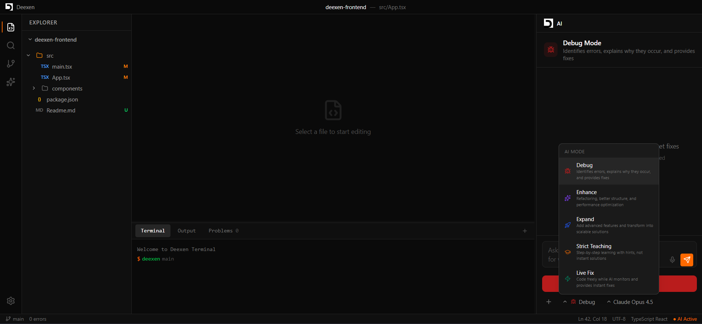

# Deexen: AI-Powered IDE for Learning and Development
    


**Deexen** is a next-generation AI-powered IDE (Integrated Development Environment) built to make coding easier and faster to learn. Unlike traditional IDEs, Deexen integrates AI directly into the editor to provide guided learning, intelligent assistance, and multiple operating modes tailored to your growth.

## 🚀 Usage

Deexen is designed to fill the gap between "coding" and "learning to code". It supports all major programming languages and offers a familiar VS Code-like interface enhanced with deep AI integration.

## ✨ Core Features

### 🧠 Multiple AI Modes
Deexen adapts to your current goal with distinct AI operating modes:
1.  **Debug Mode**: Identifies errors, explains the "why", and provides fixes.
2.  **Enhancement Mode**: Suggests refactoring, structural improvements, and optimizations.
3.  **Expansion Mode**: Helps scale projects by generating modules and advanced features.
4.  **Strict Teaching Mode**: Acts as a mentor—providing hints and guidance instead of answers.
5.  **Free Coding (Live Fix)**: Non-intrusive monitoring with instant fixes when you get stuck.

### 💻 Full-Featured IDE
*   **Monaco Editor Integration**: Professional-grade code editing experience.
*   **File System**: Create files, folders, and manage projects.
*   **Terminal**: Built-in simulated terminal for command execution.
*   **Resizable Panels**: customizable workspace layout.

### 👤 User Experience
*   **AI Launchpad**: A "Not a usual IDE" dashboard to jumpstart projects with natural language.
*   **Enhanced User Dashboard**:
    *   **Stats Overview**: View total projects, join date, and coding streak.
    *   **Project Management**: Detailed project cards with file counts, language info, search/filter capabilities, and "Open IDE" quick actions.
    *   **Dashboard Header**: Quick access to user settings and secure logout.
*   **Progress Tracking**: Track daily streaks, hours coded, and skills learned.
*   **Cloud Sync**: (Coming Soon) seamless project synchronization.

### 🔐 Authentication System (Mock)
*   **Secure Login & Signup**: Modern, glass-morphic design with real-time field validation.
*   **Validation Rules**: 
    *   Name (min 2 chars)
    *   Email format checking 
    *   Password strength (min 6 chars) feedback.
*   **Session Management**: Persists user session via `localStorage` to handle page reloads.
*   **Demo Mode**: Use any valid email/password to explore the system (Mock Auth).

## 🛠 Tech Stack

*   **Frontend Framework**: React 19 + Vite
*   **Language**: TypeScript
*   **Styling**: TailwindCSS v4
*   **State Management**: Zustand
*   **Editor**: Monaco Editor (`@monaco-editor/react`)
*   **Icons**: Lucide React
*   **Routing**: React Router v7

## 🏁 Getting Started

To run Deexen locally for development:

1.  **Clone the repository**:
    ```bash
    git clone https://github.com/your-username/deexen-frontend.git
    cd deexen-frontend
    ```

2.  **Install dependencies**:
    ```bash
    npm install
    ```

3.  **Start the development server**:
    ```bash
    npm run dev
    ```

4.  Open `http://localhost:5173` in your browser.

## 📈 How to Track Progress (For Observers)

We are building Deexen in public! Here is how you can follow the development journey and see changes as they happen:

*   **Main Branch (`main`)**: This contains the stable, verified version of the application.
*   **Feature Branches**: We develop features in isolated branches (e.g., `feature/project-setup`, `feature/ai-integration`).
*   **Pull Requests (PRs)**: To see detailed code changes and discussions, check the **Pull Requests** tab on GitHub. Each major feature merge is documented there.
*   **Commits**: View the **Commits** history to see granular updates and step-by-step implementation details.

---

*Deexen is currently in active development / Pre-Alpha.*
