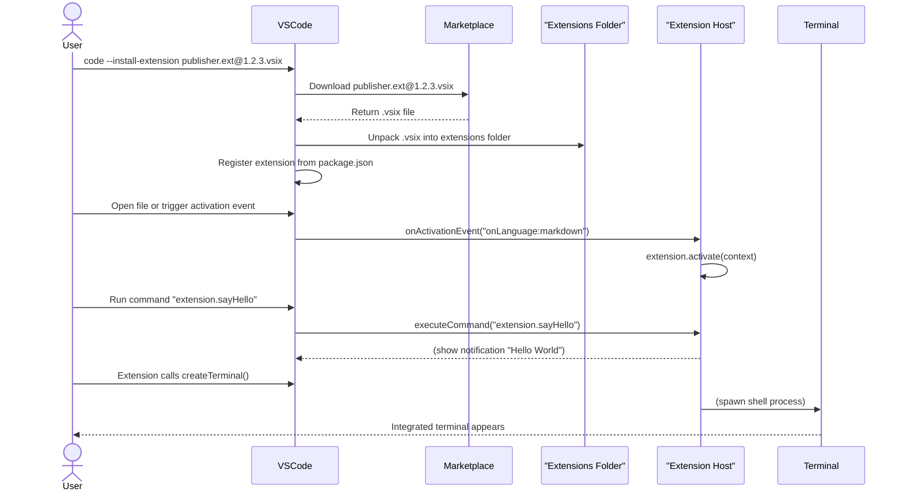

# Visual Studio Code Extensions: Installation and Integration (2026)

## Executive Summary  
Visual Studio Code (VS Code) extensions are packaged as `.vsix` files (ZIP archives with metadata) and installed via the Extensions view or the `code` CLI. Upon installation VS Code unpacks the `.vsix` into a per-user extensions directory (e.g. `%USERPROFILE%\.vscode\extensions` on Windows, `~/.vscode/extensions` on Linux/macOS【71†L920-L922】). The extension manifest (`package.json`) defines *contribution points* (such as `contributes.commands`, `contributes.terminal.profiles`, etc.) and *activation events*. VS Code runs extensions in a separate **Extension Host** process (a Node.js process on desktop/remote, or WebWorker for web), communicating with the UI via an internal IPC/RPC protocol【39†L112-L119】【42†L83-L90】. Extensions register commands (through `contributes.commands` and `vscode.commands.registerCommand`) which become available in the Command Palette. They may spawn terminals (`vscode.window.createTerminal`) or provide custom terminal profiles (`contributes.terminal.profiles` + `registerTerminalProfileProvider`【11†L1639-L1643】【11†L1657-L1664】). The VS Code CLI (`code`) can install/uninstall/list extensions (`--install-extension`, `--uninstall-extension`, `--list-extensions`【28†L702-L710】【37†L555-L563】) and control loading (`--disable-extensions`, `--enable-proposed-api`, `--update-extensions`, etc.【37†L555-L563】). By default, extensions run with **full permissions** (same as VS Code itself) – they can read/write files, run subprocesses, and make network calls【66†L442-L450】. To improve security, VS Code prompts the user to trust a publisher on first install (since v1.97) and the Marketplace scans published extensions for malware and secrets【66†L452-L460】【66†L504-L513】. For debugging, VS Code provides diagnostic commands (e.g. `code --status`, `--performance`, **Developer: Show Running Extensions**, etc. 【37†L608-L617】) and logs extension-host output in the Debug Console.  

## Extension Package Structure (`.vsix`) and Manifest  
A VS Code extension is distributed as a `.vsix` file – essentially a ZIP archive with extra headers【53†L194-L200】. The `.vsix` contains all extension files: a `package.json` manifest at its root (defining metadata, entry points, contribution points, activation events, etc.), code assets (e.g. `out/extension.js` or `dist/web/extension.js` for browser extensions), and any resources (images, `node_modules`, etc.). Unnecessary files (e.g. source `.ts`, `test/`, configs) are typically excluded via `.vscodeignore` to minimize package size【53†L194-L200】. 

The **manifest (`package.json`)** is central. It includes: 
- **`name`, `publisher`, `displayName`, `version`, `engines.vscode`** – identifies the extension and target VS Code versions.  
- **`main` or `browser`** – entry script for Node (desktop/remote) or browser (web) extension host. For example, `"main": "./out/extension.js"`. If targeting Web, a `"browser"` field points to the Web entry point.  
- **`activationEvents`** – a list of events that trigger loading the extension. Examples:  
  ```json
  "activationEvents": [
    "onCommand:extension.sayHello",
    "onLanguage:markdown",
    "onStartupFinished",
    "onFileSystem:my-scheme",
    "onView:myViewId",
    "*"
  ]
  ```  
  For instance, `"onCommand:extension.sayHello"` activates when that command is invoked【51†L209-L217】, and `"onLanguage:python"` fires when a Python file is opened【51†L176-L184】. The wildcard `"*"` activates on startup (use sparingly).  
- **`contributes`** – defines contribution points. For example, contributed commands are declared under `contributes.commands`:  
  ```json
  "contributes": {
    "commands": [
      {
        "command": "extension.sayHello",
        "title": "Hello World",
        "category": "Greeting"
      }
    ],
    "terminal": {
      "profiles": [
        {
          "id": "myExt.customProfile",
          "title": "MyShell"
        }
      ]
    }
  }
  ```  
  Here, a command `extension.sayHello` is added to the Command Palette【48†L348-L356】. The `terminal.profiles` entry contributes a new terminal profile (ID `myExt.customProfile`) 【11†L1639-L1643】.  
- **`scripts`** – NPM scripts for build/publish. Extensions often include `"scripts": { "vscode:prepublish": "npm run compile", "package": "vsce package" }` so that `vsce` builds before packaging.  

*Sample `package.json` snippet (hello world)*:  
```json
{
  "name": "my-extension",
  "publisher": "me",
  "version": "0.1.0",
  "engines": { "vscode": "^1.0.0" },
  "main": "./out/extension.js",
  "activationEvents": ["onCommand:extension.sayHello"],
  "contributes": {
    "commands": [
      {
        "command": "extension.sayHello",
        "title": "Hello World",
        "category": "Greeting"
      }
    ]
  }
}
```  
This declares an extension with a single command. When the user invokes “Hello World” (e.g. via Ctrl+Shift+P), VS Code will activate the extension (calling its exported `activate()` function) if not already active【51†L209-L217】【39†L126-L134】.

## Installation Flow  
Extensions can be installed via the **Extensions view** UI or via the **`code` CLI**. In the UI, one clicks “Install” from the Marketplace listing. Alternatively, run in a terminal:  
```bash
code --install-extension publisher.extension     # from Marketplace by ID
code --install-extension ./path/to/ext-0.1.0.vsix   # from a .vsix file
```  
VS Code will download (or read) the `.vsix`, unpack it into the user’s extensions folder, and enable it. The default installation locations are (per user)【71†L920-L922】:  

| Operating System | Extension Folder                               |
|------------------|-----------------------------------------------|
| Windows          | `%USERPROFILE%\.vscode\extensions`            |
| macOS            | `~/.vscode/extensions`                       |
| Linux            | `~/.vscode/extensions`                       |

*(Insiders builds use `.vscode-insiders\extensions` instead.)* You can override this via `code --extensions-dir <path>` or the `VSCODE_EXTENSIONS` environment variable【71†L924-L932】 (useful in enterprise scenarios).  

After unpacking, VS Code registers the extension. When VS Code restarts (or on-the-fly for some cases), it reads the `package.json` and updates its UI (commands, menus, etc.) according to `contributes`. The user may need to reload the window for activation events to work.  

## Extension Host Process and Activation Lifecycle  
VS Code isolates extensions in a separate **Extension Host process** for stability【39†L112-L119】. The Extension Host is a Node.js process (even on Windows/macOS/Linux desktop) that loads extension code and provides the `vscode` API for extensions【39†L112-L119】【39†L122-L124】. (In VS Code for the Web, extensions run in a browser WebWorker; remote-SSH or Codespaces use a Node extension host on the server.) This separation means misbehaving extensions can’t freeze the UI. All calls to `vscode.*` APIs from an extension are actually RPCs across this process boundary.  

**Activation:** VS Code starts (activates) an extension when one of its specified `activationEvents` occurs【39†L126-L134】【51†L176-L184】. Examples of triggers include opening a file of a given language (`onLanguage:python`), invoking a contributed command (`onCommand:extension.doStuff`), when a debug session starts (`onDebug`), etc. If your extension’s `activate(context)` exports an activation function, VS Code calls it once on the first such event. During activation, the extension can register commands, create views, watch files, etc. After activation, the extension remains loaded until the window closes or it is manually deactivated. For example:  
```js
// in extension.js
export function activate(context) {
  let disposable = vscode.commands.registerCommand('extension.sayHello', () => {
    vscode.window.showInformationMessage('Hello from my extension!');
  });
  context.subscriptions.push(disposable);
}
```  
Here `registerCommand` ties the `extension.sayHello` command to a callback. Because the manifest had `"activationEvents": ["onCommand:extension.sayHello"]`, this extension activates when the user runs that command【48†L348-L356】【51†L209-L217】.  

**IPC Communication:** The Extension Host and the UI thread (Electron renderer) communicate via an internal JSON-RPC-like IPC protocol (over Node.js child-process channels or sockets)【42†L107-L115】【43†L327-L332】. When the UI needs to activate an extension or execute a command, it sends a message to the Extension Host, which invokes the code and returns any result back. (The details are internal to VS Code.)  

## Registering Commands and CLI Integration  
Extensions add commands via the `contributes.commands` manifest entry and `vscode.commands.registerCommand`. In the manifest, each command has an `id` and `title`; optionally a `category`. For example【48†L348-L356】:  
```json
"contributes": {
  "commands": [
    {
      "command": "extension.sayHello",
      "title": "Hello World",
      "category": "Greeting"
    }
  ]
}
```
This makes **Hello World** appear in the Command Palette. When the user selects it, VS Code emits an `onCommand:extension.sayHello` activation event (if not already active)【48†L346-L354】. Extensions handle the command in code via `registerCommand('extension.sayHello', callback)`.  

While extension commands run inside the UI/Extension Host, VS Code’s own CLI (`code`) does not expose a generic “run extension command” flag. The `code` CLI focuses on workspace/file operations and extension management. It provides:  

- `code --list-extensions [--show-versions]`: list installed extensions (optionally with versions).  
- `code --install-extension <publisher.name | .vsix>`: install (or update) an extension by its Marketplace ID or by local VSIX path【37†L555-L563】.  
- `code --uninstall-extension <publisher.name>`: remove an extension.  
- `code --disable-extensions`: launch with all extensions disabled (never activate).  
- `code --enable-proposed-api <publisher.name>`: enable proposed (preview) APIs for an extension.  
- `code --update-extensions`: update all installed extensions and exit.  
- `code --extensions-dir <dir>`: use a custom extensions directory (as noted above).  
- Diagnostic flags: `--status` (show process usage and version info), `--performance` (capture startup performance data), `--verbose`, `--upload-logs`, etc.【37†L608-L617】.  

*Example commands:*  
```bash
# List all extensions (with publisher IDs)
code --list-extensions  
# List with versions
code --list-extensions --show-versions  
# Install an extension by Marketplace ID
code --install-extension ms-python.python@2026.5.1  
# Install from a .vsix file
code --install-extension ./myext-0.1.0.vsix  
# Uninstall
code --uninstall-extension ms-python.python  
# Upload logs or get status
code --status
code --upload-logs
```

## Terminal Integration and Tasks  
Extensions can interact with the integrated terminal. To **spawn a new terminal**, the API `vscode.window.createTerminal()` is used【47†L2836-L2844】. For example:  
```ts
const term = vscode.window.createTerminal('My Terminal', '/bin/bash', ['-l']);
term.sendText('echo Hello from extension!');
term.show();
```  
This opens an integrated terminal and runs commands in it. Extensions can also define *terminal profiles* (shell configurations) via `contributes.terminal.profiles` in `package.json`, and register a provider in code. For example【11†L1639-L1643】【11†L1657-L1664】:  
```json
"contributes": {
  "terminal": {
    "profiles": [
      {
        "id": "my-ext.terminal-profile",
        "title": "Shell from Extension"
      }
    ]
  }
}
```
```ts
vscode.window.registerTerminalProfileProvider('my-ext.terminal-profile', {
  provideTerminalProfile: (token) => {
    return { name: "Shell from Extension", shellPath: "/bin/zsh" };
  }
});
```
This makes a new terminal profile available in the Terminal’s dropdown, with ID `my-ext.terminal-profile`.  

Extensions can also contribute **tasks** or debug configurations that run CLI tools in terminals, but the above covers direct terminal use. All such terminal and task interactions still occur via the `vscode` API in the Extension Host.  

## Security and Permissions  
By default, VS Code extensions are **unrestricted**: an extension runs with the same privileges as the editor itself【66†L442-L450】. It can perform any action VS Code can, including file I/O, network requests, launching subprocesses, and modifying settings【66†L442-L450】. To mitigate risks, VS Code implements several protections: 

- **Publisher Trust**: Starting in version 1.97, when you install an extension from a third-party publisher, VS Code prompts you to confirm you trust the publisher【66†L452-L460】. Extensions installed via `code --install-extension` (CLI) do not auto-trust the publisher (the prompt must be answered on first load)【66†L468-L470】. 
- **Marketplace Protections**: The Visual Studio Marketplace scans every extension package for malware and secrets before publishing【66†L504-L513】. All published extensions are signed; VS Code verifies the signature on install【66†L532-L535】【71†L979-L983】. Verified publishers (blue checkmark) have proven domain ownership, reducing impersonation risk.  
- **Workspace Trust**: If a folder is marked *untrusted*, certain extensions or APIs may be disabled until the user explicitly trusts the workspace. See *Workspace Trust* settings for controlling execution of code and extensions in new projects.  

Administrators can further enforce security via policies (e.g. `extensions.allowed` setting, private extension galleries, etc.). 

## Debugging and Diagnostics  
For development and troubleshooting, VS Code offers several tools:  
- **Developer: Show Running Extensions** (F1) opens a view listing all extensions and their activation status.  
- **Process Explorer** (`Help → Open Process Explorer`) shows CPU/memory usage of the Extension Host.  
- **Developer Tools** (`Help → Toggle Developer Tools`) shows the renderer console, where extension errors on the UI side may appear.  
- **CLI Diagnostics**: `code --status` prints version/architecture info and extension host stats【37†L612-L619】. `code --performance` runs the startup performance profiler (enabling the *Developer: Startup Performance* command)【37†L612-L619】. `code --verbose` shows verbose logs to console. `code --upload-logs` uploads logs for debugging.  
- **Logging**: Extensions can log to the Debug Console (e.g. `console.log` in extension code appears in the Extension Development Host window when debugging), and to output channels (`vscode.window.createOutputChannel`).  

## Table: Extension Installation Paths  
Below are the default per-user extension directories by OS【71†L920-L922】 (these can be changed via `--extensions-dir` or `VSCODE_EXTENSIONS`【71†L924-L932】):

| Platform | Default Extensions Folder                                      |
|----------|---------------------------------------------------------------|
| Windows  | `%USERPROFILE%\.vscode\extensions`                            |
| macOS    | `~/.vscode/extensions`                                       |
| Linux    | `~/.vscode/extensions`                                       |

(For VS Code *Insiders*, replace `.vscode` with `.vscode-insiders`.)  

## Sequence Diagram: Install → Activate → Execute  


## Examples and Repro Steps  

- **Inspect Installed Extensions:**  
  ```bash
  code --list-extensions
  code --list-extensions --show-versions
  ```  
  These list extensions by `publisher.name` and version. (In VS Code, *Extensions → Installed* view shows the same list.)  

- **Install from VSIX:**  
  1. Package your extension with [vsce](https://code.visualstudio.com/api/working-with-extensions/publishing-extension):  
     ```bash
     npm install -g vsce
     vsce package
     ```  
     This produces `my-ext-0.1.0.vsix`【53†L194-L200】.  
  2. Install it:  
     ```bash
     code --install-extension my-ext-0.1.0.vsix
     ```  
     or in VS Code, use *Extensions View → ... → Install from VSIX*.  

- **Run Extension Commands:** In a development copy, press F5 to launch an Extension Development Host and use the *Command Palette* to run your commands. The palette will list contributed commands (e.g. *Hello World* from our example).  

- **Spawn a Terminal:** In extension code, use:  
  ```ts
  const term = vscode.window.createTerminal("MyShell", "/bin/bash", ["-l"]);
  term.show();
  ```  
  This opens a new integrated terminal running Bash.

- **Debugging:** Use **Developer: Show Running Extensions** to verify activation times. Check the *Extension Host* output in the Debug Console for logs. Try `code --status` or `code --performance` for diagnostics.

See above references for more details. 

**Sources:** Official VS Code docs on [Publishing & VSIX]【53†L194-L200】, [Commands & Activation Events]【48†L348-L356】【51†L209-L217】, [Extension Host]【39†L112-L119】, [CLI documentation]【28†L702-L710】【37†L555-L563】, and [Extension Runtime Security]【66†L442-L450】【71†L979-L983】, as well as VS Code source comments and Marketplace info. 

